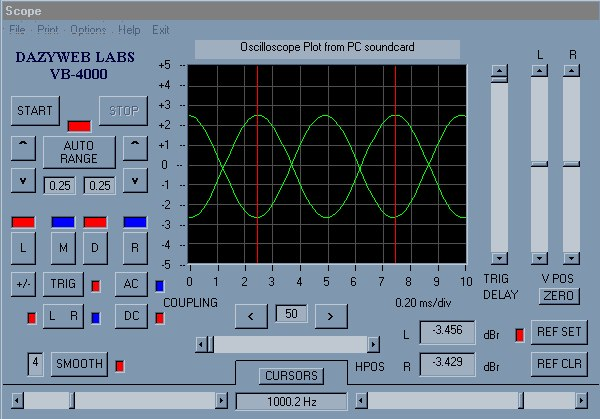



## DWL Oscilloscope

### Description

Realtime soundcard based stereo oscilloscope with triggering, cursors, amplitude autoranging, plot file save and plot printing.
 
### More Info
 

             |
---                |---
**Submitted On**   |2001-06-24 18:47:12
**By**             |[Vic Richardson](https://github.com/Planet-Source-Code/PSCIndex/blob/master/ByAuthor/vic-richardson.md)
**Level**          |Advanced
**User Rating**    |4.9 (74 globes from 15 users)
**Compatibility**  |VB 6\.0
**Category**       |[Complete Applications](https://github.com/Planet-Source-Code/PSCIndex/blob/master/ByCategory/complete-applications__1-27.md)
**World**          |[Visual Basic](https://github.com/Planet-Source-Code/PSCIndex/blob/master/ByWorld/visual-basic.md)
**Archive File**   |[DWL Oscill216426242001\.zip](https://github.com/Planet-Source-Code/vic-richardson-dwl-oscilloscope__1-24403/archive/master.zip)

